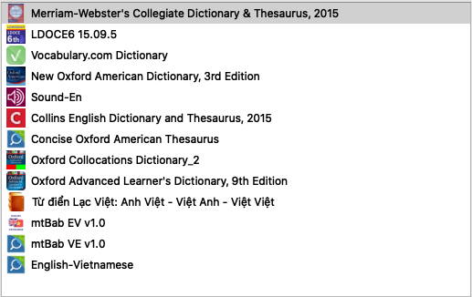

# Essential Apps
Những phần mềm cần thiết khi học tiếng Anh

## Mục lục:

<!-- vim-markdown-toc GFM -->

* [Anki](#anki): phần mềm flash cards, chú ý phần cài thêm add-ons
* [Google Drive](#google-drive): phần mềm để lưu nhanh bài tập vào máy tính/điện thoại
* [GoldenDict](#goldendict): phần mềm tra nhiều từ điển cùng lúc 
       * [Thêm từ điển cho GoldenDict](#thêm-từ-điển-cho-goldendict) 
       * [Sắp xếp lại trình tự từ điển](#sắp-xếp-lại-trình-tự-từ-điển)
* [mDict](#mdict): tra từ trên điện thoại/máy tính bảng 
       * [iPhone: App Store](#iphone-app-store) 
       * [Android: Google Play](#android-google-play)
* [Audacity](#audacity): luyện nghe trên máy tính
* [Phần mềm thay thế Audacity trên điện thoại](#phn-mm-thay-th-audacity-trên-in-thoi): luyện nghe trên điện thoại
* [Zoom](#zoom): để học online
* [Evernote](#evernote): để lưu lại ghi chép hàng tuần

<!-- vim-markdown-toc -->

## Anki

* [Bản cho Win](https://apps.ankiweb.net/downloads/current/anki-2.1.19-windows.exe?u=1)
* [Bản cho Mac](https://apps.ankiweb.net/downloads/current/anki-2.1.19-mac.dmg)
* [Điện thoại iPhone](https://itunes.apple.com/us/app/ankimobile-flashcards/id373493387) (mất phí)
* [Điện thoại Android](https://play.google.com/store/apps/details?id=com.ichi2.anki) (free)

Sau khi cả nhà cài Anki xong, cả nhà cài thêm add-ons cho Anki bằng cách: 

1. Download file zip và giải nén ra: [addons21.zip](https://github.com/hieuvijjo/essential_apps/blob/master/files/addons21.zip)
2. Chọn `Tools > Add-ons > View Files`
3. Xoá toàn bộ thư mục `addons21`
4. Copy thư mục `addons21` đã giải nén ở bước 1 vào thay. 
> **Lưu ý:** cần copy thư mục `addons21` trong cùng, tránh tình trạng `addons21` bên trong `addons21` do giải nén.
5. Tắt Anki đi bật lại

Minh hoạ nhanh các bước làm: 

> **Lưu ý:** 
> Bạn nào tắt đi bật lại thấy báo lỗi, khả năng là do thiếu `ffmpeg`, cần cài thêm `ffmpeg` [theo hướng dẫn](https://github.com/hieuvijjo/huongdan_deck_to_audio).

## Google Drive 

* Win/Mac: [Backup and Sync](https://www.google.com/drive/download/), **chỉ cần** download cái `Backup and Sync` thôi. 
Sau khi cài xong, cả nhà bật `Backup and Sync` và làm theo hướng dẫn:

* Android: [Google Play](https://play.google.com/store/apps/details?id=com.google.android.apps.docs)
* iPhone: [App Store](https://apps.apple.com/app/google-drive/id507874739)

## GoldenDict
* [Bản cho Win](https://github.com/goldendict/goldendict/wiki/Early-Access-Builds-for-Windows): chọn mục `Download (zip)` hoặc `Download (installer)`.  
Nếu download bản `zip` chỉ cần giải nén ra và tạo shortcut ra màn hình là xong. 
Nếu download bản `installer` thì cần cài.
* [Bản cho Mac](https://github.com/goldendict/goldendict/wiki/Early-Access-Builds-for-Mac-OS-X): Nên chọn bản `Sierra or later`.

#### Thêm từ điển cho GoldenDict

Lúc cài về `GoldenDict` vẫn trống trơn, chưa có từ điển, cả nhà cần:

1. Download các files từ điển và giải nén ra: [từ điển cho GoldenDict](https://www.dropbox.com/s/y46jsmvr3umrgk7/Golden%20Dictionary.zip?dl=0)
2. Bật GoldenDict, chọn `Edit > Dictionaries > Add...` 
Chọn đường dẫn đến thư mục từ điển cho `GoldenDict` vừa giải nén. 
3. Tick dấu `Recursive` và chọn `Rescan now`.

Minh hoạ nhanh các bước làm: 

Cả nhà thử tra 1 từ, sẽ thấy `GoldenDict` đồng loạt tra nhiều từ điển cùng lúc.

> **Tip:** 
> *Để tiện khi tra từ*, cả nhà nên chọn `View` và tick vào `Search Pane`

#### Sắp xếp lại trình tự từ điển

1. Chọn `Edit > Dictionaries > Dictionaries`
2. Di lại trình tự từ điển theo sở thích. Từ điển nào không dùng di vào ô `Inactive`

> **Tip**:  
> * Các bạn mới có thể thử sắp xếp từ điển `Longman`, `Lạc Việt`, và `Oxford Advanced Learner` lên hàng đầu tiên 
> * Các bạn advanced hơn, mình cực kì khuyến khích dùng nhiều từ điển `Merriam-Webster`, `New Oxford American` và `Vocabulary.com`

Cả nhà có thể tham khảo cách mình sắp xếp từ điển hiện tại:

## mDict
Phần mềm thay thế GoldenDict trên điện thoại

#### iPhone: [App Store](https://itunes.apple.com/cn/app/mdict/id389083586?mt=8)
Có 2 cách để thêm từ điển:

**Cách lâu, nhưng mà dễ**

1. Cả nhà `Add to my drive` thư mục [từ điển Golden Dictionary](https://drive.google.com/drive/folders/1kvYtDZ9K1UwlXuIx2HFNcl9lTFQBoVj_?usp=sharing).
2. Cài [Google Drive](https://apps.apple.com/us/app/google-drive/id507874739) cho điện thoại.
3. Mở app `Files`
4. Chọn `Google Drive` tìm đến chỗ chứa thư mục `Golden Dictionary`
5. Chọn `Select` (góc trên bên phải), và select thư mục `Golden Dictionary`
6. Chọn `Copy` (bên dưới, chính giữa), và chọn đến `On My iPhone > MDict` (có thể phải đợi khá lâu, bởi máy cần download gần 4gb)

**Cách nhanh, nhưng có thể có bạn lúng túng**

1. Cài [iTunes](https://www.apple.com/itunes/) nếu dùng Win hoặc Mac (có hệ điều hành dưới Catalina)

2. Cắm cáp nối iPhone với laptop

3. Dùng tính năng `File Sharing` trong `iTunes` để copy thư mục `Golden Dictionary` đã download về máy tính vào trong máy tính.

> Máy mac hệ điều hành `Catalina` thì chỉ cần vào `Finder` sẽ thấy điện thoại kết nối với `Finder` ngay ở bên phải như ổ cứng ngoài. Click vào và chọn `Files > MDict` rồi di thư mục `Golden Dictionary` vào đây. 

#### Android: [Google Play](https://play.google.com/store/apps/details?id=cn.mdict)
Cắm cáp nối điện thoại với máy tính, và copy thư mục `Golden Dictionary` vào trong `/mnt/sdcard/mdict/doc`

## Audacity

Link download: [Audacity](https://www.fosshub.com/Audacity.html)

* Win: chọn `Audacity Windows Installer` để cài hoặc `Audacity Windows Zip` rồi giải nén ra và dùng luôn
* Mac: chọn `Audacity macOS DMG`

Hướng dẫn chi tiết sử dụng Audacity: [AUDACITY: hãy làm chủ hoàn toàn việc luyện nghe tiếng Anh của bản thân!](https://www.youtube.com/watch?v=RV4jUEaWCtc) (**Ai cũng nên xem hết nếu chưa xem!!!**)

## Phần mềm thay thế Audacity trên điện thoại

Cần thiết để luyện tập các track audio mà không cần dùng Audacity.

* iPhone: [Speater](https://apps.apple.com/us/app/speater-smart-repeater/id549627415) (mất phí, nhưng đáng đồng tiền, có cả bản free cho cả nhà thử, tìm trên AppStore)
* Android: [WorkAudioBook](https://play.google.com/store/apps/details?id=com.povalyaev.WorkAudioBookPaid) (mất phí, nhưng đáng, có bản free để thử, cả nhà tìm trên Google Play Store)

## Zoom

Cần thiết để học online.

* Win/Mac: nhấp download [Zoom Client for Meetings](https://zoom.us/download#client_4meeting)
* iPhone: [App Store](https://itunes.apple.com/us/app/id546505307)
* Android: [Google Play](https://play.google.com/store/apps/details?id=us.zoom.videomeetings)

## Evernote

Cần thiết để lưu ghi chép bài tập hàng tuần.

* Win/Mac: https://evernote.com/download
* iPhone: [App Store](https://itunes.apple.com/app/evernote/id281796108?mt=8)
* Android: [Google Play](https://play.google.com/store/apps/details?id=com.evernote)

